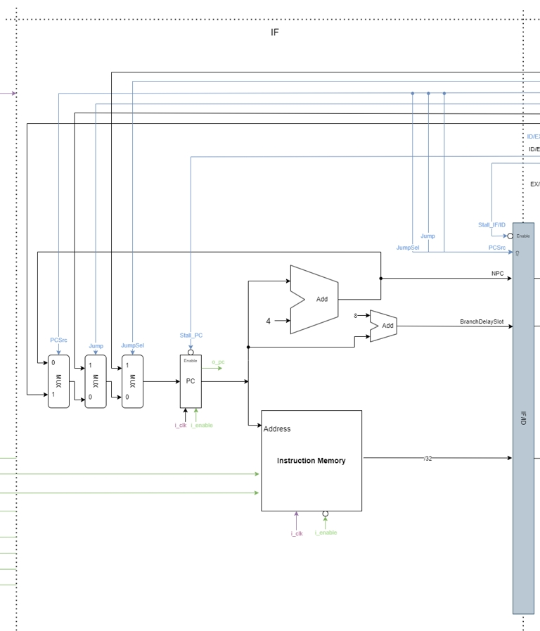
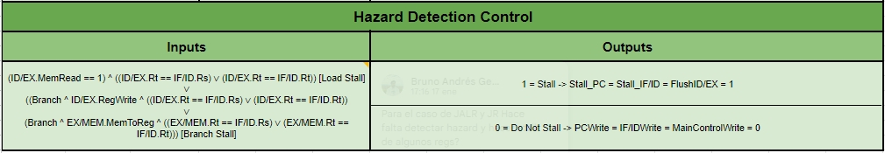

# MIPS Processor Implementation (PIPELINE)

En la arquitectura de un procesador, un pipeline es una técnica que permite mejorar el rendimiento al ejecutar múltiples instrucciones de manera simultánea mediante la división del proceso de ejecución en varias etapas independientes. Cada etapa del pipeline realiza una parte específica del proceso de ejecución de instrucciones, lo que permite que múltiples instrucciones se ejecuten simultáneamente.

En este proyecto, implementaremos un pipeline de 5 etapas para un procesador MIPS simplificado. Las etapas del pipeline son las siguientes:

1. _IF (Instruction Fetch)_: En esta etapa, se busca la siguiente instrucción en la memoria de programa. La instrucción es leída desde la memoria y se prepara para su decodificación.
2. _ID (Instruction Decode)_: Durante esta etapa, la instrucción se decodifica y se identifican las operaciones a realizar. Además, se leen los registros necesarios para la ejecución de la instrucción.
3. _EX (Execute Instruction)_: En esta etapa, se ejecuta la instrucción. Dependiendo del tipo de instrucción, pueden realizarse operaciones aritméticas, lógicas o de control de flujo.
4. _MEM (Memory Access)_: Durante esta etapa, se accede a la memoria de datos si es necesario. Esto implica leer o escribir datos desde o hacia la memoria, dependiendo de la instrucción ejecutada.
5. _WB (Write Back)_: En la última etapa del pipeline, se escriben los resultados de la ejecución de la instrucción en los registros del procesador, si es necesario. Esto asegura que los resultados estén disponibles para instrucciones futuras que los requieran.

Implementar un pipeline de 5 etapas permite mejorar el rendimiento del procesador al ejecutar múltiples instrucciones de manera simultánea, maximizando la utilización de los recursos del procesador y reduciendo el tiempo de ejecución de los programas.

Las instrucciónes implementadas son las siguientes:


Además, el procesador debe tener soporte para los siguientes tipos de riesgos:

1. **Estructurales**: Se producen cuando 2 instrucciones tratan de utilizar el mismo recurso en el mismo ciclo.
2. **De Datos**: Se intenta utilizar un dato antes de que esté disponible, manteniendo el orden estricto de lecturas y escrituras.
3. **De Control**: Se intenta tomar une decisión sobre una condición todavía no evaluada.

Para este proyecto, el programa a ejecutar será cargado en la memoria de programa mediante un archivo de ensamblado, por lo que se implementó un programa ensamblador, y luego se transmite este programa mediante la interfaz UART antes de comenzar a ejecutar. También se incluye una unidad de debug para enviar información desde el cpu (Registros, Memoria y PC). Esto implica 2 **Modos de Ejecución**:

1) **Continuo**: Se envía un comando a la FPGA por la UART y esta inicia la ejecución del programa hasta llegar al final del mismo (Instrucción HALT). Llegado ese punto se muestran todos los valores indicados en pantalla.
2) **Paso a Paso**: Enviando un comando por la UART se ejecuta un ciclo de Clock. Se deben mostrar en cada paso los valores indicados.

Para ver cómo utilizar este programa, dirigirse a la sección de **[Usage](#usage)** de este documento.


_Integrantes_: Bruno A. Genero, Ignacio Ibañez Sala.

## Módulo PIPELINE

En este módulo se implementa el pipeline en sí para el procesador MIPS. A continuación se describen todos los submódulos que conforman esta parte del sistema.


### [Módulo Instruction Fetch (IF)](PIPELINE/src/Mod_IF/)

El módulo `IF` (Instruction Fetch) es responsable de buscar la siguiente instrucción en la memoria de programa y prepararla para su decodificación.

Parámetros:

- `INST_SZ`: Tamaño de la instrucción en bits.
- `PC_SZ`: Tamaño del contador de programa en bits.
- `MEM_SZ`: Tamaño de la memoria de instrucciones en bits.

Entradas:

- `i_clk`: Señal de reloj.
- `i_reset`: Señal de reinicio.
- `i_write`: Señal de control de escritura en la memoria.
- `i_enable`: Señal de habilitación de ejecución.
- `i_instruction_F`: Instrucción almacenada.
- `i_branch_addr_D`: Dirección de la instrucción de salto condicional.
- `i_jump_addr_D`: Dirección de la instrucción de salto incondicional.
- `i_rs_addr_D`: Dirección del registro GPR[rs].
- `i_pc_src_D`: Señal de control para la selección de la fuente del contador de programa.
- `i_jump_D`: Señal de control para el salto incondicional.
- `i_jump_sel_D`: Señal de control para la selección del destino del salto.
- `i_stall_pc_HD`: Señal de control para el estancamiento del contador de programa.

Salidas:

- `o_pc`: Contador de programa actualizado.
- `o_npc_F`: Siguiente valor del contador de programa.
- `o_branch_delay_slot_F`: Instrucción en la ranura de retardo de salto condicional.
- `o_instruction_F`: Instrucción recuperada.

Funcionalidad:

- El módulo `IF` recibe la dirección de la siguiente instrucción a buscar desde el módulo `pc` y la utiliza para acceder a la memoria de instrucciones mediante el módulo `instruction_mem`.
- La instrucción recuperada se almacena en `o_instruction_F`.
- El contador de programa se actualiza según el flujo de control y se proporciona en `o_pc`.
- El módulo maneja el estancamiento del contador de programa (`i_stall_pc_HD`) y los controles de salto condicional e incondicional (`i_jump_D` e `i_jump_sel_D`, respectivamente).



### [Módulo Instruction Decode (ID)](PIPELINE/src/Mod_ID/)

El módulo `ID` (Instruction Decode) se encarga de decodificar las instrucciones recuperadas del módulo IF y generar señales de control correspondientes para las etapas posteriores del pipeline.

Parámetros:

- `INST_SZ`: Tamaño de la instrucción en bits.
- `REG_SZ`: Tamaño de los registros en bits.
- `FORW_EQ`: Habilitar la lógica de forwarding.
- `OPCODE_SZ`: Tamaño del campo de opcode en bits.
- `FUNCT_SZ`: Tamaño del campo de funct en bits.

Entradas:

- `i_clk`: Señal de reloj.
- `i_reset`: Señal de reinicio.
- `i_instruction_D`: Instrucción recuperada del módulo IF.
- `i_npc_D`: Siguiente dirección de instrucción (NPC).
- `i_forward_eq_a_FU`: Señal de control para forwarding de datos desde ALU.
- `i_forward_eq_b_FU`: Señal de control para forwarding de datos desde memoria.
- `i_alu_result_M`: Resultado anterior de la ALU (para forwarding).
- `i_branch_MC`: Señal de control para la ejecución de un salto condicional.
- `i_equal_MC`: Señal de control para la ejecución de una comparación igual.
- `i_reg_write_W`: Señal de control para escribir en los registros.
- `i_write_register_D`: Registro de destino de escritura.
- `i_write_data_D`: Datos a escribir en el registro.
- `i_debug_addr`: Dirección de registro para depuración.

Salidas:

- `o_reg`: Valor del registro seleccionado para depuración.
- `o_jump_addr_D`: Dirección de salto calculada.
- `o_branch_addr_D`: Dirección de salto condicional calculada.
- `o_read_data_1_D`: Datos leídos del primer registro.
- `o_read_data_2_D`: Datos leídos del segundo registro.
- `o_pc_src_D`: Señal de control para la selección de la fuente del contador de programa.
- `o_instr_imm_D`: Inmediato de la instrucción.
- `o_instr_rs_D`: Registro RS de la instrucción.
- `o_instr_rt_D`: Registro RT de la instrucción.
- `o_instr_rd_D`: Registro RD de la instrucción.
- `o_alu_op_MC`: Señal de control para la operación de la ALU.
- `o_reg_dst_MC`: Señal de control para el registro de destino.
- `o_jal_sel_MC`: Señal de control para la selección de destino de salto y enlace.
- `o_alu_src_MC`: Señal de control para la selección de fuente de datos para la ALU.
- `o_branch_MC`: Señal de control para la ejecución de un salto condicional.
- `o_equal_MC`: Señal de control para la comparación igual.
- `o_mem_read_MC`: Señal de control para la lectura de memoria.
- `o_mem_write_MC`: Señal de control para la escritura en memoria.
- `o_bhw_MC`: Señal de control para el tamaño de memoria.
- `o_jump_MC`: Señal de control para el salto incondicional.
- `o_jump_sel_MC`: Señal de control para la selección de destino de salto.
- `o_reg_write_MC`: Señal de control para la escritura en registros.
- `o_bds_sel_MC`: Señal de control para la selección de la ranura de retardo de salto condicional.
- `o_mem_to_reg_MC`: Señal de control para la escritura desde memoria a registros.
- `o_halt_MC`: Señal de control para detener la ejecución.

Funcionalidad:

- El módulo `ID` decodifica la instrucción recuperada (`i_instruction_D`) para generar señales de control para las etapas posteriores del pipeline.
- Calcula las direcciones de salto condicional e incondicional y selecciona la fuente del contador de programa (`o_pc_src_D`).
- Realiza operaciones de forwarding para los datos leídos de los registros.
- Genera señales de control para la unidad de control principal (`MainControlUnit`) basadas en el tipo de instrucción decodificada.
- Proporciona señales de control para el acceso a memoria, escritura en registros y otras operaciones de ejecución de instrucciones.


### [Módulo Execute Instruction (EX)](PIPELINE/src/Mod_EX/)

El módulo `EX` (Execution) se encarga de realizar las operaciones de ejecución de las instrucciones, como cálculos aritméticos y lógicos, desplazamientos, y determinación de los datos a escribir en registros.

Parámetros:

- `INST_SZ`: Tamaño de la instrucción en bits.
- `ALU_OP`: Tamaño del campo de operación de la ALU en bits.
- `FORW_ALU`: Tamaño del campo de control para el forwarding de la ALU.
- `ALU_SEL`: Tamaño del selector de operación de la ALU.

Entradas:

- `i_read_data_1_E`: Datos leídos del primer registro (desde la memoria de registros).
- `i_read_data_2_E`: Datos leídos del segundo registro (desde la memoria de registros).
- `i_alu_result_M`: Resultado anterior de la ALU (para forwarding).
- `i_read_data_W`: Datos leídos (para forwarding, desde la memoria de datos).
- `i_alu_src_MC`: Señal de control para la selección de la fuente de datos para la ALU.
- `i_reg_dst_MC`: Señal de control para el registro de destino.
- `i_jal_sel_MC`: Señal de control para la selección de destino de salto y enlace.
- `i_alu_op_MC`: Señal de control para la operación de la ALU.
- `i_forward_a_FU`: Señal de control para el forwarding de datos desde la ALU.
- `i_forward_b_FU`: Señal de control para el forwarding de datos desde la ALU.
- `i_instr_imm_D`: Inmediato de la instrucción (extendido signo).
- `i_instr_rt_D`: Registro RT de la instrucción.
- `i_instr_rd_D`: Registro RD de la instrucción.

Salidas:

- `o_alu_result_E`: Resultado de la operación de la ALU.
- `o_operand_b_E`: Operando B (para datos de escritura).
- `o_instr_rd_E`: Registro RD de la instrucción (para registro de escritura).

Funcionalidad:

- El módulo `EX` realiza operaciones de ejecución de las instrucciones recibidas, basándose en las señales de control y los datos de entrada.
- Realiza la selección de registros y la extensión de inmediatos según sea necesario.
- Utiliza la unidad de control de la ALU (`AluControl`) para determinar la operación que debe realizar la ALU.
- Realiza las operaciones específicas de acuerdo al tipo de instrucción, como operaciones aritméticas, lógicas y de desplazamiento.
- Proporciona los resultados de las operaciones y los datos necesarios para las etapas posteriores del pipeline.


### [Módulo Memory Access (MEM)](PIPELINE/src/Mod_Mem/)

El módulo `MEM` (Memory) se encarga de acceder a la memoria de datos para realizar operaciones de lectura y escritura, según sea necesario por las instrucciones ejecutadas.

Parámetros:

- `INST_SZ`: Tamaño de la instrucción en bits.
- `MEM_SZ`: Tamaño de los bits de direccionamiento de memoria.

Entradas:

- `i_clk`: Señal de reloj.
- `i_debug_addr`: Dirección de memoria para depuración.
- `i_alu_result_E`: Resultado de la ALU.
- `i_operand_b_E`: Operando B.
- `i_mem_write_M`: Señal de control de escritura en memoria.
- `i_bhw_M`: Señal de control de tamaño de memoria.

Salidas:

- `o_debug_mem`: Datos a enviar al depurador.
- `o_alu_result_M`: Resultado de la ALU.
- `o_read_data_M`: Datos leídos desde la memoria de datos.

Funcionalidad:

- El módulo `MEM` actúa como una interfaz entre el procesador y la memoria de datos.
- Utiliza el módulo `data_mem` para realizar operaciones de lectura y escritura en la memoria de datos.
- Proporciona los datos leídos desde la memoria de datos a la siguiente etapa del pipeline (etapa de escritura en registro).
- Proporciona el resultado de la ALU a la siguiente etapa del pipeline (etapa de escritura en memoria), para posibles operaciones de forwarding.
- Gestiona las señales de control y las direcciones de memoria para realizar operaciones de lectura y escritura de acuerdo a las necesidades de las instrucciones ejecutadas.


### [Módulo Write Back (WB)](PIPELINE/src/Mod_WB/)

El módulo `WB` (Write Back) se encarga de seleccionar los datos que se escribirán en el registro de destino según las señales de control y enviarlos a la etapa de escritura en registro del pipeline del procesador MIPS.

Parámetros:

- `INST_SZ`: Tamaño de la instrucción en bits.

Entradas:

- `i_alu_result_M`: Resultado de la ALU.
- `i_read_data_M`: Datos leídos desde la memoria de datos.
- `i_branch_delay_slot_M`: Datos de la ranura de retardo de salto condicional.
- `i_mem_to_reg_W`: Señal de control para seleccionar si los datos provienen de la ALU o de la memoria de datos.
- `i_bds_sel_W`: Señal de control para seleccionar si se debe escribir en la ranura de retardo de salto condicional.

Salidas:

- `o_write_data_W`: Datos que se escribirán en el registro de destino.

Funcionalidad:

- El módulo `WB` selecciona los datos que se escribirán en el registro de destino de acuerdo con las señales de control recibidas.
- Utiliza un multiplexor (`mem_to_reg_mpx`) para seleccionar entre el resultado de la ALU y los datos leídos desde la memoria de datos, según la señal de control `i_mem_to_reg_W`.
- Utiliza otro multiplexor (`bds_sel_mpx`) para seleccionar entre los datos seleccionados por el primer multiplexor y los datos de la ranura de retardo de salto condicional, según la señal de control `i_bds_sel_W`.
- Finalmente, envía los datos seleccionados (`o_write_data_W`) a la etapa de escritura en registro del pipeline del procesador MIPS.


### [Módulos de Control](PIPELINE/src/Mod_Ctrl_Units/)

A continuación se explican los distintos módulos de control utilizados para manejar el conjunto de instrucciones mencionados en el pipeline.

#### [Módulo Main Control Unit](PIPELINE/src/Mod_Ctrl_Units/MainControlUnit.v)

A continuación se muestra una tabla con todas las instrucciones implementadas y los valores que deben tomar cada una de las señales de control para que cada una de ellas funcione correctamente.


Estas señales se deciden a partir de las entradas de la Unidad de Control: OpCode (instruction[31:26]) y Function Field (instruction[5:0]).

La explicación de estas señales de control se explica con la siguiente tabla:


#### [Módulo Forwarding Unit](PIPELINE/src/Mod_Ctrl_Units/ForwardingUnit.v)

La siguiente tabla explica cómo se decide cuando hacer cortocircuito de algún valor, ya sea para la ALU o para el comparador en ID:


#### [Módulo Hazard Detection Unit](PIPELINE/src/Mod_Ctrl_Units/HazardDetectionUnit.v)

La siguiente tabla explica como se decide un stall en el pipeline, ya sea por un branch o un load:



#### [Módulo ALU Control](PIPELINE/src/Mod_Ctrl_Units/AluControl.v)

La siguiente tabla muestra el conjunto de instrucciones implementadas junto con las respectivas operaciones de ALU que cada una de ellas necesita que se realice para cumplir su función.


También vemos los códigos que se utilizan para ejecutar estas operaciones (ALU Control Output) dependiendo de las entradas (Function Field y ALUOp).


### [Clock Wizard](PIPELINE/src/clk_wiz/)

El clock wizard se encarga de estabilizar la señal del reloj para que pueda ser correctamente utilizada.


Para el diseño actual del procesador, la frecuencia máxima que esta herramienta permite es de **80 MHz**.

### [Pipeline - PIPELINE Top Module](PIPELINE/pipeline.v)

A continuación se muestra un diagrama de alto nivel del módulo Top del PIPELINE.


## Módulo DEBUGGER

En este módulo se implementa la comunicación del exterior con el procesador. Específicamente, se desarrollan los modulos de la UART y la interfaz entre esta y el pipeline.

### [Módulo UART](DEBUGGER/src/Mod_UART/)

El módulo `uart` implementa una interfaz UART (Universal Asynchronous Receiver/Transmitter) para la comunicación serie. Este módulo permite la transmisión y recepción de datos en serie a través de una línea de comunicación.

Parámetros:

- `DBIT`: Número de bits de datos.
- `SB_TICK`: Número de ticks para bits de parada (16/24/32 para 1/1.5/2 bits).
- `DVSR`: Divisor de la velocidad de baudios (Clock/(BaudRate*16)).
- `FIFO_W`: Número de bits de dirección del FIFO (número de palabras en el FIFO = 2^FIFO_W).

Entradas:

- `i_clk`: Señal de reloj.
- `i_reset`: Señal de reinicio.
- `i_rd_uart`: Señal de lectura de entrada del FIFO del receptor.
- `i_wr_uart`: Señal de escritura de entrada del FIFO del transmisor.
- `i_rx`: Señal de entrada del receptor UART.
- `i_w_data`: Datos de entrada del FIFO del receptor UART.

Salidas:

- `o_tx_full`: Señal de FIFO del transmisor lleno.
- `o_rx_empty`: Señal de FIFO del receptor vacío.
- `o_tx`: Datos transmitidos.
- `o_r_data`: Datos recibidos.

Funcionalidad:

- El módulo `uart` consta de varios submódulos para realizar las operaciones de transmisión y recepción UART.
- Un generador de velocidad de baudios (`baud_rate_gen`) genera los ticks necesarios para sincronizar la transmisión y recepción UART con la velocidad de baudios especificada.
- El módulo `uart_rx` maneja la recepción de datos desde la línea UART y los almacena en un FIFO de recepción.
- El módulo `fifo_rx_unit` es un FIFO de recepción que almacena los datos recibidos desde `uart_rx`.
- El módulo `uart_tx` maneja la transmisión de datos hacia la línea UART desde un FIFO de transmisión.
- El módulo `fifo_tx_unit` es un FIFO de transmisión que almacena los datos a transmitir desde la interfaz de entrada `i_w_data`.
- El módulo `uart_tx_unit` controla la transmisión de datos desde el FIFO de transmisión hacia la línea UART.
- La asignación `tx_fifo_not_empty` se utiliza para indicar si el FIFO de transmisión no está vacío.


### [Módulo UART-Pipeline Interface](DEBUGGER/src/Mod_INTERFACE/)

El módulo `uart_interface` actúa como una interfaz entre el módulo UART y el pipeline del procesador. Se encarga de recibir datos del UART, procesarlos y enviarlos al pipeline, así como de enviar datos desde el pipeline al UART.

Parámetros:

- `N`: Longitud de los datos UART.
- `W`: Número de bits de dirección para la memoria de registro.
- `PC_SZ`: Tamaño del contador de programa.
- `INST_SZ`: Tamaño de las instrucciones.
- `DATA_SZ`: Tamaño de los datos.

Entradas:

- `i_clk`: Señal de reloj.
- `i_reset`: Señal de reinicio.
- `i_halt`: Señal para detener la ejecución del pipeline.
- `i_reg_read`: Datos desde la memoria de registros.
- `i_mem_read`: Datos desde la memoria de datos.
- `i_pc`: Contador de programa actual.
- `i_data`: Datos recibidos del UART.
- `i_fifo_empty`: Señal que indica si el FIFO del UART está vacío.
- `i_fifo_full`: Señal que indica si el FIFO del UART está lleno.

Salidas:

- `o_tx_data`: Datos a ser escritos en el UART.
- `o_wr`: Señal para escribir en el UART.
- `o_rd`: Señal para leer del UART.
- `o_write_mem`: Señal para escribir en la memoria de instrucciones.
- `o_enable`: Señal para habilitar la ejecución del pipeline.
- `o_reset`: Señal de reinicio de software.
- `o_inst`: Instrucción a ser escrita en la memoria de instrucciones.
- `o_addr`: Dirección de depuración de registro/memoria.

Funcionalidad:

- El módulo `uart_interface` gestiona el flujo de datos entre el UART y el pipeline del procesador.
- Se utilizan diversos registros internos para controlar el estado y los datos de entrada y salida.
- El módulo maneja múltiples estados, incluyendo la carga de tamaño de programa, la carga de programa, la escritura de instrucción, la depuración y el envío de datos al UART.
- Los estados de espera se utilizan para manejar situaciones en las que el FIFO del UART está vacío o lleno.
- El módulo se reinicia cuando se activa la señal de reinicio `i_reset`.

A continuación se muestra un diagrama de la máquina de estados finita que representa esta interfaz:


### [Debugger - DEBUGGER Top Module](DEBUGGER/debugger.v)

A continuación se muestra un diagrama de alto nivel del módulo Top del DEBUGGER.


## [Módulo CPU - Project Top Module](cpu.v)

A continuación se muestra un diagrama de alto nivel del módulo Top del sistema completo.


## Módulo ASSEMBLER

En este módulo se implementa el programa encargado de leer un programa en lenguaje ensamblador de MIPS y transformarlo en lenguaje de máquina para transmitirlo al procesador.

### [Assembler Program](ASSEMBLER/assembler.py)

Este código de Python convierte instrucciones en ensamblador MIPS a su representación binaria o hexadecimal. La estructura principal es la clase `Assembler`, que maneja la conversión de texto a código binario o hexadecimal.

- **Clase Assembler**: Procesa los archivos de entrada, elimina comentarios, construye un mapa de etiquetas y realiza la conversión de las instrucciones.

- **Clase InstructionParser**: Analiza las instrucciones MIPS y las convierte en su representación binaria. Tiene subclases para manejar diferentes tipos de instrucciones (R, I, LS, J).

- **Clases de tipo de instrucción específicas**: Cada clase se encarga de convertir un tipo específico de instrucción MIPS a su representación binaria.

- **Funciones auxiliares y estructuras de datos**: Ayudan en la conversión de las instrucciones, como la búsqueda en tablas de conversión y la manipulación de cadenas.

En resumen, este código proporciona un conjunto de herramientas para traducir código MIPS a su representación binaria o hexadecimal, útil para simulación, depuración o ejecución en un procesador MIPS.

## [MIPSdb](MIPSdb.py)

Toda la funcionalidad del proyecto implementado se puede probar con la interfaz gráfica de usuario "MIPSdb". La misma se encarga de tomar un archivo con código ensamblador, compilarlo, escribirlo en la memoria de instrucciones de la FPGA y luego ejecutarlo, mostrando los resultados.


### Errores Conocidos

Al aumentar la frecuencia del reloj unos 10Hz de la de uso normal, es decir, a 90 0 100GHz, se presentan los siguientes errores de timing:


Los caminos que no pueden cumplir con los requerimientos:


Y el esquemático del camino más critico:


### Usage

1. **Sintetizar el programa con un sintetizador (por ejemplo, Vivado)**:
   - Sintetiza el código del programa en un formato compatible con la FPGA que se va a utilizar.

2. **Configurar la FPGA con el programa sintetizado**:
   - Utiliza las herramientas proporcionadas por el fabricante de la FPGA para cargar el programa en la FPGA.

3. **Crear un entorno virtual de Python**:
   - Abre una terminal y navega hasta el directorio donde se encuentra el código del programa.
   - Crea un entorno virtual de Python con el comando:

     ```bash
     python3 -m venv venv
     ```

4. **Activar el entorno virtual**:
   - Activa el entorno virtual con el siguiente comando en Linux/macOS:
  
     ```bash
     source venv/bin/activate
     ```

     O con el siguiente comando en Windows:

     ```bash
     venv\Scripts\activate
     ```

5. **Instalar los requisitos del programa**:
   - Asegúrate de que estás dentro del entorno virtual activado.
   - Instala los requisitos del programa ejecutando el siguiente comando:

     ```bash
     pip install -r reqs.txt
     ```

6. **Ejecutar la GUI del programa**:
   - Una vez instalados los requisitos, ejecuta la interfaz gráfica del programa con el siguiente comando:

     ```bash
     python MIPSdb.py
     ```

7. **Interactuar con la interfaz gráfica**:
   - La interfaz gráfica debería abrirse, permitiéndote interactuar con el programa y realizar las operaciones deseadas.
